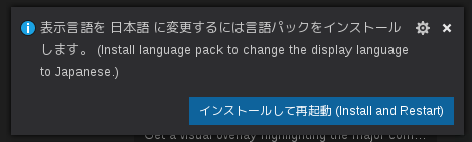

# 開発用エディタのインストールと設定

開発用エディタはVisual Studio Codeをオススメしています。
Windows, mac, Linux でほぼ同じように使えます。

## インストール

<https://code.visualstudio.com/>

### Amazon Linux 2の場合

Amazon Linux 2 は RedHat系のディストリビューションなので、`.rpm` パッケージを使います。
案内の通り、Visual Studio Codeのリポジトリを登録します。

```sh
sudo rpm --import https://packages.microsoft.com/keys/microsoft.asc
sudo sh -c 'echo -e "[code]\nname=Visual Studio Code\nbaseurl=https://packages.microsoft.com/yumrepos/vscode\nenabled=1\ngpgcheck=1\ngpgkey=https://packages.microsoft.com/keys/microsoft.asc" > /etc/yum.repos.d/vscode.repo'
```

`yum`コマンドでインストールします。

```sh
yum check-update
sudo yum install code -y
```

インストールが完了したら起動します。

```sh
code
```



### macの場合

ダウンロードしたzipファイルを解凍して、`Visual Studio Code.app`をApplicationsに登録します。
(登録しなくても使えます)

`Visual Studio Code.app` をダブルクリックして、起動します。

## Visual Studio Code操作メモ

* コマンドパレット CTRL+SHIFT+P
* 設定エディタ(JSON)を開く CTRL+,
* Visual Studio Code内のターミナルを開く CTRL+SHIFT+@

## Go言語用の拡張をインストール

Visual Studio Code はコマンドを使って拡張をインストールすることが出来ます。
Extensionsビューから検索してインストールすることも出来ます。

### Go言語サポートのインストール

```sh
code --install-extension ms-vscode.Go
```

Extensionsビューの検索に `go` と入力して検索してもすぐ見つかります。

### テーマとファイルアイコンをインストール

```sh
code --install-extension dunstontc.dark-plus-syntax
code --install-extension robertohuertasm.vscode-icons
```

### Go言語を書くときにオススメのパッケージを一気にインストール

```sh
code --install-extension codezombiech.gitignore
code --install-extension CoenraadS.bracket-pair-colorizer
code --install-extension bungcip.better-toml
code --install-extension christian-kohler.path-intellisense
code --install-extension ms-vsliveshare.vsliveshare
code --install-extension mikestead.dotenv
```

### テーマとアイコンを設定

#### アイコンの設定

コマンドパレット(CTRL+SHIFT+P)を開き `icon theme` と入力します。
Preferences: File Icon Theme を Enter で選択し、↑↓キーでアイコンを選択します。
インストールした `VSCode icons` を選択してください。

#### テーマの設定

コマンドパレット(CTRL+SHIFT+P)を開き `color theme` と入力します。
Preferences: Color Theme を Enter で選択し、↑↓キーでアイコンを選択します。
インストールした `dark-plus-syntax` を選択してください。
