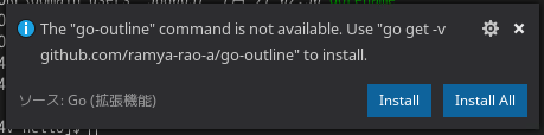

# Hello World

プログラミング言語の入門の基本、 Hello World のプログラムを作成します。

## ディレクトリの作成

ソースコードを書くためのディレクトリを作成します。

ポイント: $GOPATH/src にソースコードを置くのがGo言語のやり方

```sh
mkdir -p $GOPATH/src/hello
```

作成したディレクトリでVisual Studio Codeを開きます。

```sh
cd $GOPATH/src/hello
code .
```

## hello.go を書く

1. 新規ファイル `hello.go` を作成
2. 1行目に `package main` を追加
3. メイン関数の定義 `func main() {` を書く
4. メイン関数の中身に文字列を出力する `println()` を書く
5. printlnのパラメータに "Hello 世界!" を渡す
6. メイン関数の定義を `}` で閉じる

### 完成形

```go
package main

func main() {
  println("Hello 世界!")
}
```

### Go言語補助ツールのインストール

書いたソースコードを保存すると、Go言語の補助ツールをインストールするかVisual Studio Code が聞いてくるので、
Install All を選択します。



```sh
Installing 10 tools at /home/gemcook/go/bin
  gocode
  gopkgs
  go-outline
  go-symbols
  guru
  gorename
  dlv
  godef
  goreturns
  golint

Installing github.com/mdempsky/gocode SUCCEEDED
Installing github.com/uudashr/gopkgs/cmd/gopkgs SUCCEEDED
Installing github.com/ramya-rao-a/go-outline SUCCEEDED
Installing github.com/acroca/go-symbols SUCCEEDED
Installing golang.org/x/tools/cmd/guru SUCCEEDED
Installing golang.org/x/tools/cmd/gorename SUCCEEDED
Installing github.com/derekparker/delve/cmd/dlv SUCCEEDED
Installing github.com/rogpeppe/godef SUCCEEDED
Installing github.com/sqs/goreturns SUCCEEDED
Installing github.com/golang/lint/golint SUCCEEDED

All tools successfully installed. You're ready to Go :).
```

## 書いたコードの実行方法

### すぐに実行する方法

```sh
go run hello.go
```

### ビルドする方法

```sh
go build hello.go
./hello
```

### コマンドとしてインストールする方法

```sh
go install hello.go
ll $GOBIN
hello
```
